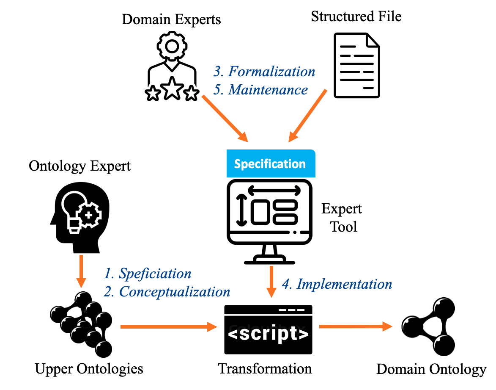

# Systematized Procedure for Automating the Retrieval of Knowledge within Smart Industries methodology.

This repository contains the SPARKS methodology, a comprehensive solution designed to bridge the gap between expert knowledge and data-driven artificial intelligence in Industry 4.0 contexts. SPARKS offers a systematic procedure for experts to intuitively transform their insights on production flows and system faults into a domain-specific ontology using a user-friendly Graphical User Interface (GUI). Additionally, the repository showcases the utilization of structured documents, such as Programmable Logic Controller (PLC) code, as an essential component in modeling process flows. 



The SPARKS upper ontology can be found in within the docs folder and the documentation itself is made available at: [https://predict-idlab.github.io/SPARKS/](https://predict-idlab.github.io/SPARKS/)

The editor and the instruction how to run the editor can be found at the src folder. This src folder also contain example PLC files that can be loaded to verify the editor mappings.


# Referencing
If you use SPARKS in a scholarly article, we would appreciate a citation:

```
@misc{sparks,
  author    = {{Bram Steenwinckel, Pieter Moens, Joris Mussche, Sofie Van Hoecke and Femke Ongenae}},
  title     = {{Systematized Procedure for Automating the Retrieval of Knowledge within Smart Industries}},
  year      = {2024},
  url       = {https://github.com/predict-idlab/SPARKS}
}
```

